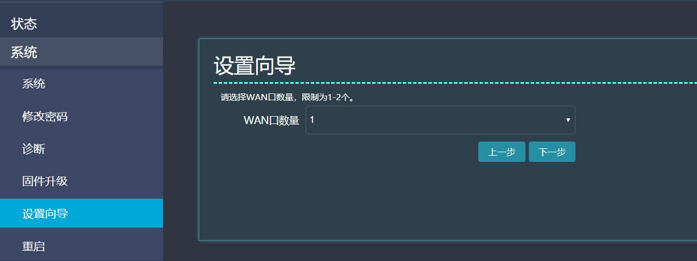

# SDWAN BOSS管理系统-客户侧

**SDWAN BOSS管理系统V1.0.5**

## Getting Super Powers

Becoming a super hero is a fairly straight forward process:

**产品手册-客户侧**

```
$ give me super-powers
```

长沙市同迅计算机科技有限公司


 Super-powers are granted randomly so please submit an issue if you're not happy with yours.


2020-3

Once you're strong enough, save the world:

版权声明

长沙市同迅计算机科技有限公司版权所有，并保留对本文档及本声明的最终解释权和修改权。本文档中出现的任何文字叙述、文档格式、插图、照片、方法、过程等内容，除另有特别注明外，其著作权或其它相关权利均属于长沙市同迅计算机科技有限公司。未经长沙市同迅计算机科技有限公司书面同意，任何人不得以任何方式或形式对本文档内的任何部分进行复制、摘录、 备份、修改、传播、翻译成其他语言、将其全部或部分用于商业用途。


```bash
# Ain't no code for that yet, sorry
echo 'You got to trust me on this, I saved the world'
```


免责条款


本文档仅用于为最终用户提供信息，其内容如有更改，恕不另行通知。

长沙市同迅计算机科技有限公司在编写本文档的时候已尽最大努力保证其内容准确可靠，但长沙市同迅计算机科技有限公司不对本文档中的遗漏、不准确、或错误导致的损失和损害承担责任。

信息反馈

如果您有任何宝贵意见，请反馈至：

邮箱：support@xspeeder.com

电 话：0731-85833738 传 真：0731-85833738

技术支持论坛：[http://bbs](http://sangfor.360help.com.cn/).xspeeder.com

您也可以访问神行者网站：[www.](http://www.sangfor.com.cn/)[xspeeder.com](http://www.sangfor.com.cn/) 获得最新技术和产品和方案信息。

修订记录

| **修订版本号** | **作者** | **日期** | **备注** |
| :--- | :--- | :--- | :--- |
| V1.0 | 杨鑫 | 2020-03-20 |  |
|  |  |  |  |
|  |  |  |  |

目录

SDWAN BOSS管理系统V1.0.5 1

产品手册-客户侧 1

长沙市同迅计算机科技有限公司 1

第一章 SDWAN的安装 4

1.1. 环境要求 4

1.2. 电源 4

1.3. 产品类型 4

1.4. 配置与管理 7

1.5. 设备默认接线参数 7

第二章 SDWAN组网方式 7

2.1. hub-spoke组网 8

2.2. full mesh组网 8

第三章 SDWAN应用场景 9

3.1. 企业组网 9

3.2. 企业上云 10

3.3. SAAS加速 10

第四章 SDWAN ZTP一键部署 11

4.1. 第一阶段 11

4.2. 第二阶段 11

第五章 SDWAN的部署方式 13

5.1. 网关部署模式 13

5.2. 网桥部署模式 13

5.3. 单臂旁挂部署模式 14

5.4. VRRP主备部署模式 15

第六章 SDWAN云平台使用 16

6.1. 政企 16

6.2. CPE管理 17

6.3. 内网 24

6.4. 链路 24

6.5. 拓扑 24

6.6. SAAS加速 25

6.7. 极速上云 25

6.8. 用户管理 25

6.9. 日志管理 26

6.10. 交易管理 26

6.11. 个人中心 26

第七章 本地控制器模式 28

第八章 CPE远程管理 29

## 第一章 SDWAN的安装

本部分主要介绍神行者 SDWAN 系列产品的硬件安装。硬件安装正确之后,您才可以进行配置和调试。

* 1. **环境要求**

SDWAN设备可在如下的环境下使用：

* 工作电压：应能够工作在 100～240V/47-63Hz
* 环境温度：-5～55 摄氏度
* 相对湿度：5%～95%RH（非凝结）
* 抗雷击：应符合YD/T993-2006《电信终端设备防雷技术要求及试验方法》标准要求。

为保证系统能长期稳定地运行，应保证电源有良好的接地措施、防尘措施，保持使用环境的空气通畅和室温稳定。本产品符合关于环境保护方面的设计要求，产品的安放、使用和报废应遵照相关法律、法规要求进行。

* 1. **电源**

神行者 SDWAN系列产品使用交流220V到240V电源。在您接通电源之前，请保证您的电源有良好的接地措施。

SDWAN 设备需工作在稳定电压情况下，当电压波动频率较大时需额外添加稳压器。

* 1. **产品类型**

神行者SD-WAN 产品形态分为物理硬件和虚拟化软件两种平台。物理硬件支持ARM/MIPS和X86硬件平台设备，虚拟化网元应支持基于虚拟机的云化部署方式。

* * 1. **SD-WAN M1网关**


* 产品外观以实物为准，图片仅供参考。
  * 1. **SD-WAN M2网关**


* 产品外观以实物为准，图片仅供参考。
  * 1. **SD-WAN M3网关**


* 产品外观以实物为准，图片仅供参考。
  * 1. **SD-WAN M4网关**


* 产品外观以实物为准，图片仅供参考。
  * 1. **SD-WAN W1网关**


* 产品外观以实物为准，图片仅供参考。
  * 1. **SD-WAN 虚拟平台支持**


* 虚拟平台支持仅展示部分，其它新平台支持可能未能及时更新说明
  * 1. **硬件性能参数**


* 1. **配置与管理**

在配置网关之前，您需要配备一台电脑，配置之前请确定该电脑的网页浏览器（只支持IE 内核的浏览器，比如 Internet Explorer、Maxthon 等，Opera、Firefox、Safari、Chrome 等浏览器无法正常配置）能正常使用。

内网有DHCP服务：把神行者SDWAN 设备 WAN口连接在同一个局域网内，通过网络自动发现对设备进行配置。

内网无DHCP服务：把电脑与神行者SDWAN 设备LAN口连接电脑网卡，通过浏览器对设备进行配置。

* 1. **设备默认接线参数**

请依据不同设备型号。

ARM/MIPS：区分WAN和LAN。

X86：区分WAN、LAN、MGMT。

默认IP:192.168.1.1 帐号：admin 密码：xwan

## 第二章 SDWAN组网方式

根据用户使用环境的不同，SDWAN 设备支持以下二种组网方式。

* 1. **hub-spoke组网**


组网特定：分支通过SDWAN骨干网实现快速加密的访问总部网络

* 1. **full mesh组网**


组网特定：分支、总部通过SDWAN骨干网实现快速加密的相互访问。

## 第三章 SDWAN应用场景

* 1. **企业组网**


* 1. **企业上云**


* 1. **SAAS加速**


## 第四章 SDWAN ZTP一键部署

SDWAN ZTP功能将初始化配置和镜像升级文件的位置等信息在CPE第一次上电后，以响应其DHCP请求的方式发送给交换机，从而让CPE能够自动去向SDWAN控制器获取初始化配置，下载和升级镜像文件。  
从而大大加快了SDWAN网络的构建速度，同时减小了人为出错的机率。


* 1. **第一阶段**

\(Phase 1\) 是对CPE设备入网前进行一些准备工作（也即所谓的CPE On-Boarding）。

此时CPE设备还处在设备厂商，在这里关于这个CPE设备的一系列具体信息 \(比如: 软/硬件序列号，端口数量和类型，IP地址和其配置方式，以及即将被部署的站点位置信息，等等\) 都会由网络运维人员手动录入SD-WAN云平台系统。  
人工录入的过程通常以填写模板的方式来进行，从而提升效率、减少人为出错机率。填写好的配置模板会自动生成配置文件存放在系统里，用于之后对CPE设备的自动化配置。

* 1. **第二阶段**

\(Phase 2\) 是CPE设备被邮寄到企业用户站点之后的一系列操作。

1. CPE设备开机上电 \(在此之前要确保CPE设备的WAN端口已连上可用的WAN网络\)。
2. CPE设备通过WAN端口以DHCP的方式自动获取WAN IP地址 。
3. CPE设备通过DNS Server查询并获得SDWAN控制器的IP地址。SDWAN控制根据硬件ID获取CPE信息，实行自动上线。
4. SDWAN控制器通过比对CPE设备的软/硬件序列号等信息，查找出这个CPE设备属于哪个企业用户，从而导向相应的验证服务器 \(Auth. Server\) 对CPE设备进行安全验证。
5. 安全验证的方式可以有很多种，包括使用邮件或短信验证的方式来确保CPE设备是在正确的客户站点入网。验证通过后，Auth. Server 会将 SD-WAN Controller 的IP 地址发送给 CPE设备，从而在Controller 和 CPE 设备之间建立起安全的控制信道。
6. Controller 将之前生成的初始化的配置信息发送给CPE设备，从而完成设备的初始化配置和升级。之后Controller和CPE设备会交换本站点和其他站点的路由及安全密钥等信息，用于建立跨站点之间的数据层XWAN链路。

## 第五章 SDWAN的部署方式

根据用户使用环境的不同，SDWAN 设备支持以下七种部署模式：网关模式、网桥模式、单臂旁挂模式（旁路模式）。

* 1. **网关部署模式**

SDWAN 设备网关模式部署，适用于ARM/MIPS和X86设备， 示例拓扑如下：


配置步骤：

第一步：配置设备WAN，设备自动上线。

第二步：配置SDWAN CPE。

第三步：配置内网路由。

* 1. **网桥部署模式**

SDWAN 设备网桥模式部署，适用于X86设备， 示例拓扑如下：


特点：部署在内网和防火墙之间，最小的拓扑改动，不需要修改防火墙和内网配置参数。

配置步骤：

第一步：将XS1接原来交换机接防火墙的内网口，XS2接原来防火墙内网口。

第二步：设备自动上线，开通CPE即可组网。

* 1. **单臂旁挂部署模式**

SDWAN 设备单臂旁挂模式部署，适用于ARM/MIPS和X86设备， 示例拓扑如下：


特点：旁挂在内网部署，无需变更内网结构，零风险，但是需要在防火墙指静态路由。

配置步骤：

第一步：ARM/MIPS设备将WAN口接入内网即可（X86设备接XS2）。

第二步：设备自动上线，开通CPE即可组网。

* 1. **VRRP主备部署模式**

SDWAN 设备主备部署模式，适用于ARM/MIPS和X86设备， 示例拓扑如下：


特点：VRRP主备部署，用于某些特殊重要场景，业务不能中断，利用两条ISP链路进行冗余。

IP配置：客户机的网关需要配置成节点的虚拟IP（VIP）地址。

## 第六章 SDWAN云平台使用

帐号请联系商务开通。

该系统内所有账号的默认初始密码为：123456，请登录后及时修改。


浏览器要求：Google Chrome、Firefox内核，IE9以上。

* 1. **政企**

自己企业的总部和分部信息。


更多操作可查看相关服务。


* 1. **CPE管理**

企业所有的终端盒子均展示在此栏。


* * 1. **CPE信息**

单击CPE名称右侧弹出CPE详细信息（udid、状态、mac、CPU、IP归属、链路、端口信息等）。


CPE流量信息，可显示当前CPE实时速率。

CPE时延和心跳，为到POP点时延。


CPE性能参数，显示该CPE的并发和CPU内存。


CPE日志，显示CPE上线的WAN IP和出口IP、上下线时间。


* * 1. **CPE信息修改**

单击【修改】按钮，弹出对话框，用户可对CPE分部和名称进行修改。

别名：给CPE盒子取一个中文名称，方便区分。

节点类型：分支节点、中心节点。

* **分支节点：**分支节点一般用于分支机构，分支节点只可与中心节点通信，

各分支节点之间不可相互通信。

* **中心节点：**中心节点一般用户总部机构，中心节点可与该企业任何分支节点通信，可有多个中心节点，中心节点之间可相互互访。

**简单概述：**总部中心节点，分部分支节点为**hub-spoke**组网模式。

总部分部均为中心节点为**full mesh**组网模式。

**注：云平台CPE名称字体为蓝色状态正常，红色为断开连接。**


* * 1. **CPE内网管理**

单击【内网管理】按钮，弹出对话框，用户可对CPE内网进行管理。

内网网段：就是终端CPE的LAN口网段IP，通告其它分部CPE该CPE的内网可访问IP或网段。

旁路跨三层路由网段：填写三层交换机网内需要转发的内网网段。


* * 1. **CPE配置管理**

单击【配置管理】按钮，弹出对话框，用户可对CPE配置进行管理（LAN、XWAN、WIFI、DNS、静态路由、ACL规则、其他）。

LAN配置：修改CPE的LAN口IP地址，即DHCP内网网关，掩码一般为24或25。


XWAN配置

模式：路由模式、旁路NAT模式、旁路路由模式，参考第五章。

加密：国密SM4

MTU：一般默认不用修改，当WAN线路为VPN出口等特殊场景，需要修改。


WIFI配置：带WIFI的CPE支持配置无线参数（SSID、加密方式、密码）。


DNS配置：配置DHCP主辅DNS；配置域名强制本地A记录解析；配置域名强制重定向到指定上层DNS。


静态路由：用于内网特殊路由指向内网其它设备时使用。


* 1. **内网**

将企业内部所有终端的内网网段集中显示在此，方便集中管理。


* 1. **链路**

将企业内部所有终端的链路信息显示在此，方便集中管理，及时续费。


* 1. **拓扑**

显示企业组网的拓扑图，例图为典型的Hub-spoke组网。


* 1. **SAAS加速**

显示企业的SAAS加速集，IP加速集或域名加速集。

* 1. **极速上云**

显示企业的CXP上云对接VBR端口，可对接阿里云、腾讯云、华为云、金山云、京东云、百度云、七牛云、平安云、京东云、青云、AWS、UCloud。

* 1. **用户管理**

可对自己的帐号密码等信息修改，还可给同时添加维护帐号。


* 1. **日志管理**

管理帐号的登录日志、操作日志查询。


* 1. **交易管理**

显示企业充值和续费等信息。

* 1. **个人中心**

开通和故障等消息推送接收管理，站内信管理。


添加消息接收人，单击【消息接收人】-【添加】弹出添加设置对话框。

支持手机、邮箱、企业微信、钉钉群机器人等。


站内信，显示资金、产品、告警、公告等信息。


## 第七章 本地控制器模式

适用于神行者路由客户群体，不需要使用骨干网，自有公网节点，需要使用控制器组网，具体收费标准联系商务。

这里会需要使用【POP管理】功能。添加POP点方法。

云平台配置：名称、端口（XWAN配置的服务端端口，默认4000）、线路IP（路由的出口线路IP）为必填项。


**路由配置：在路由WEB【网络设置】-【XWAN】**。

先配置好XWAN服务、地址池等，然后在主控接入填入服务标识1和2，域名为xwan.netsxz.com，端口默认（也可对端口进行自定义修改）。


**注：云平台POP点名称字体为黑色状态正常，红色为断开连接。**

POP上线后，即可使用该点进行组网，组网方法参考前六章。

##  CPE远程管理

CPE管理，点击CPE名称旁边的链接按钮，即可弹出该CPE远程管理页面。


总览：WAN口状态、无线状态、XWAN状态、端口状态。


固件升级：手动更新固件版本，非同型号固件无法更新。


设置向导：初始化CPE一键向导。



服务：端口映射、DMZ主机、动态DNS（DDNS\)、UPNP不详细介绍了，主备切换参考第二章。


网络：WAN配置、LAN配置、DNS配置、静态路由，目前这些配置都可以通过云平台完成；负载均衡配合云平台ACL使用，目前功能还在完善。


XWAN界面：XWAN的UDID、状态和在线时间、模式，加速目标地址、互联目标地址。


